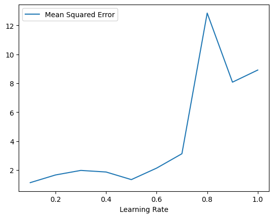

## Part 1: Feature Maps

> Completed By: ...

## Part 2: Logistic Regression

> Completed By: Robin Chen

### Introduction
This document outlines the final results of the second part of Assignment 2. A logistic regression algorithm was used to classify data points based on given features. The model was trained using gradient descent and evaluated based on cross-entropy loss.

### Performance Summary
The following results were recorded during training, showing the logits (z values), predicted probabilities (y values), and loss at different steps:

z: [-1.5828, 2.6186, 3.3725, 3.3725]
y: [0.1704, 0.9320, 0.9668, 0.9668]
Loss: 0.0811597

z: [-1.5909, 2.6257, 3.3792, 3.3792]
y: [0.1693, 0.9325, 0.9670, 0.9670]
Loss: 0.0805828

These results show that the model steadily improved, with loss decreasing over iterations. The predicted probabilities (y values) indicate a higher confidence in classification as training progressed.

### Final Loss & Model Performance
The final loss achieved was ≈ 0.08058, showing effective convergence of the logistic regression model. The decision boundary became more stable, and class separation improved as training continued.

## Part 3: Linear Regression

> Completed By: Shurjo Majumder

### Introduction

This document outlines the final results of the third part of Assignment 2. A gradient descent linear regression algorithm was used to model a surface lying in 3D space.

### Performance Chart

The following graph demonstrates the mean squared error of the model for various learning rates. The MSE was determined through 10-fold cross validation over the training dataset.

The mean squared error tends to increase as the learning rate increases, meaning that lower values produce less error. The least error was observed when the learning rate was $\lambda = 0.1$.

### Best Learning Rate

The best learning rate found was $\lambda = 0.1$. It displayed a mean squared error of $\approx 1.129$ during cross validation, and a mean squared error of $\approx 1.412$ during testing with the test dataset.
